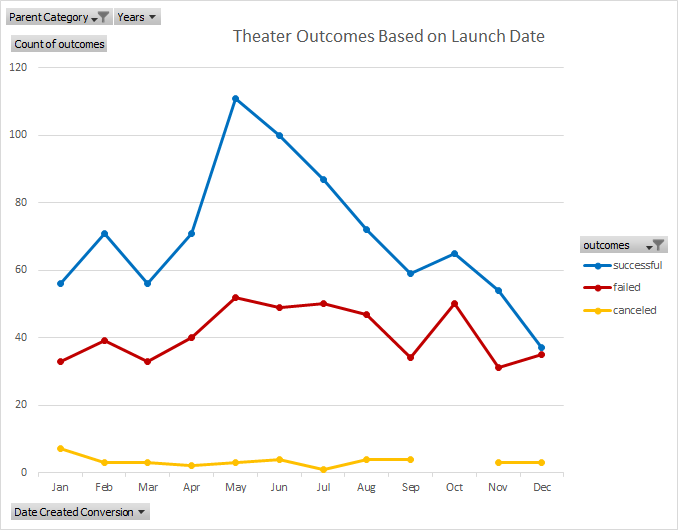
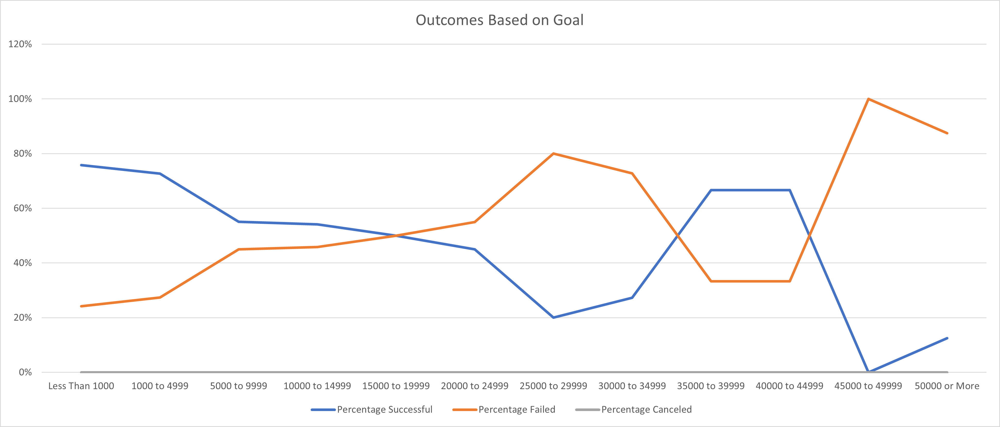

# Kickstarting with Excel

## Overview of Project
Performing analysis on Kickstarter data.

### Purpose
To uncover trends of Kickstarter data to glean insight on viable kickstarter fundraising tactics.

## Analysis and Challenges
### Analysis of Outcomes Based on Launch Date

The above chart examines the outcomes based on launch date and is filtered on the Theater parent company Year. Because we are looking at all years, all years are selected in the filter dropdown menu. This chart data came from a pivot table that filters on the parent company and years.   
### Analysis of Outcomes Based on Goals

The above chart visualizes the percentage of successsful, failed and canceled plays based on the fundraising goal amount. This is done by breaking out the 'sucessful', 'failed' and 'canceled' goal amounts by defined goal thresholds through utilizing the COUNTIFS function to collect the outcome and goal data. 
### Challenges and Difficulties Encountered
I did not encounter any challenges compiliing the data and creating the Outcomes Based on Launch Date chart, however if one might encounter challenges if they have to group the "Row Labels" in the pivot chart to show the months of the year instead of a short date. 
The one challenge I encountered initially was forgetting to add the third criteria range and criteria ('Kickstarter Data'!$R:$R, "plays") to isolate the correct 'Subcategory' in the Kickstarter data worksheet. After adding the third criteria range and 'plays' criteria proper calculations were able to be populated in the desired columns.

## Results

- Two conclusions that can be drawn regarding the Outcomes based on Launch Date are: 
  1. According to the Kickstarter data the most profitable time to launch a Kickstarter campaign is May. 
  2. According to the Kickstarter data the least profitable times are October and December with December being the worst time. 

- What can you conclude about the Outcomes based on Goals?
  From the data which is reflected in the Outcomes Based on Goals Chart the most successful 'plays' Kickstarters are those that have fundraising goals less than $1000. These kickstarters have a success rate of 76%.  

- What are some limitations of this dataset?
 One of the limitations of this data set is that it does not show a propensity pool of potential donors who have the capacity and affinity to donate to the client's Kickstarter. Therefore the dataset is static - it offers a history of Kickstarters that can be narrowed down to the client's criteria of fundraising for her play 'Fever' but it does not show other sources in which the client could prospect to reach her goal of approximately $10,000. Moreover, the data does not have listed subcategory genres to further investigate.  

- What are some other possible tables and/or graphs that we could create?
With the data given I do not believe that there are any other tables or graphs that could be create. The tables and graphs for Theater Outcomes by Launch Date and Outcomes Based on Goals could further be segmented by looking at geographical location (i.e. US, GB, etc.) so if the client wanted to isolate by geography she could do so. 

# kickstarter-analysis
Overview: Performing analysis on Kickstarter data to uncover trends

## Findings
  Through the analysis of the Kickstarter data 'Theater' parent companies have the highest overall successfull fundraising outcomes. On a closer analysis of subcategory statistics plays have the highest success rate for fundraising overall as well as in the US and Great Britain. Moreover the data shows that the month that recieved the best outcomes based on launch date was May and although there are high success outcomes in January, June, July and October the failed outcomes had roughly the same number of failed campaigns launched durring that time. 
  Through an analysis of descriptive statistics we are able to glean that failed Kickstarter campaigns have higher funraising goals with a mean goal of $10,554, as opposed to the average successful Kickstarter campaign that has a mean goal of $5,049. Because the estimated Kickstarter fundraising goal for 'Fever' is nearly twice the amount of the mean goal of successful Kickstarter campaigns this does not bode well for meeting the estimated $10,000 fundraising goal. 
  For the future project of creating a play in Great Britian the data shows that the mean campaign goal for musicals is approximately $4,000. 

## Visualizations

## Recommendations

In a complete analysis of Kickstarter Data supplied the recommendation to the client is that she try to get her play produced in the US for less that her estamted budget of $10,000. A more conservative kickstarter goal would be approximately $5,000 launching in the month of May. Furthermore, when looking to a potential future project in Great Britian, the client should try to get her play produced for less than £4,000 as the mean campaign goal is around £4,000 with half of the campaign goals being less than £2,000, which is just over the 3rd quartile for amounts pledged.

